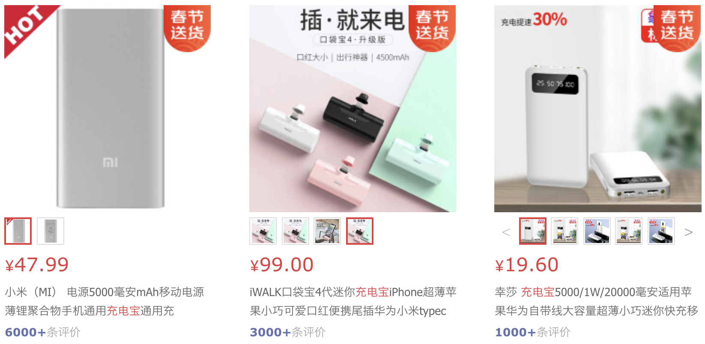
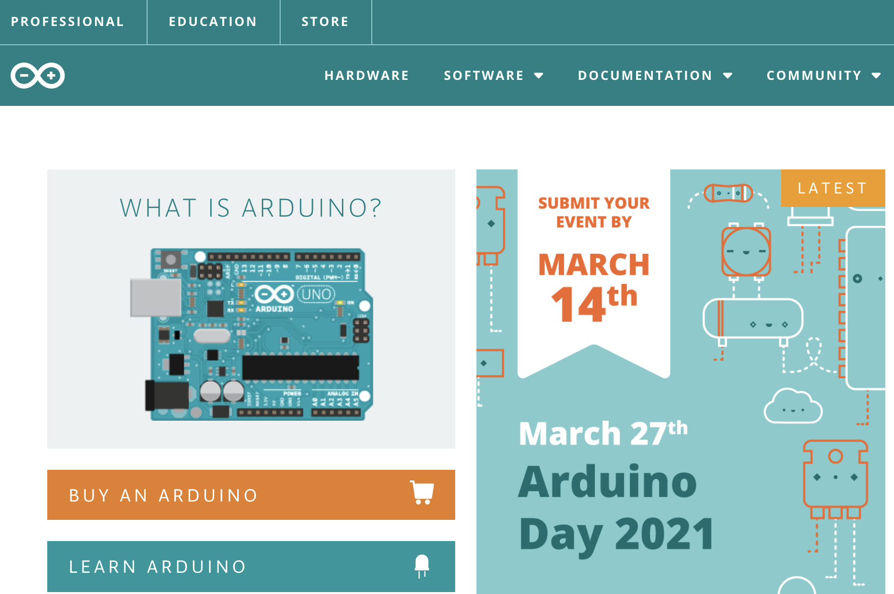
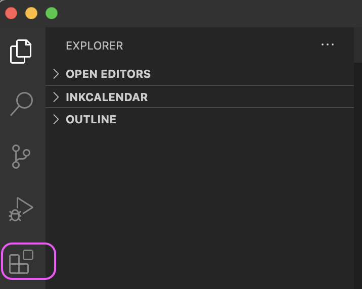

# 1. 电子墨水屏日历

为什么会想做这个项目呢？去年的时候收到了两本日历，都是那种每天撕一张的那种厚厚一本，用起来很有感觉，每天看着数字的变化，还有页面上的鸡汤信息，可以提醒我自己每天更好地珍惜时间！但是但是，这个每天扔一张纸感觉好不环保呀！所以当时就想到了，电子墨水屏其实用在这个场景中非常合适，省电，不需要花哨的彩色显示，不需要高频度的刷新。搜了一下居然发现小米的平台上有卖，但是作为技术宅来说，感觉这个实现起来难度应该不会太高，买一个来实在没感觉，之前一直想要尝试 Arduino，这可算有了个机会！

由于我自己也是第一次用这些硬件，这种搭建项目的软件平台，所以踩了很多坑。想要实现的小伙伴们，参照我以下的步骤相信会走得很顺利！

# 2. 实现步骤

## 2.1 硬件

为了实现日历的效果，同时满足低功耗低的需求，那么毋庸置疑电子墨水屏幕是最好的选择，如果想要显示效果更炫，可以考虑 “红黑白” 或者 “黄黑白” 的电子墨水屏，价格也差不多。具体信息可以参考微雪电子官网：https://www.waveshare.net/

- 电子墨水屏：Waveshare 5.83inch e-Paper（价格：¥ 231）

有了屏幕以后，那就需要考虑怎么才能控制这块屏幕进行显示，所以我们需要一个屏幕的 **驱动模块**，由于这里的电子墨水屏使用的是 SPI （Serial Peripheral Interface）通信接口，所以如果手头有这样接口的开发板，都可以进行屏幕的驱动，比如树莓派什么的，但是开发板一般都比较贵，像一个树莓派基本都是 ¥200+ 的价格，不太适合放在我们这个小项目里面用，那比较好的选择还是按照电子屏厂家推荐的那样：使用专用的 e-Paper Driver Board。

专用的驱动板类别很多，价格在 ¥50 - ¥ 80 不等，只有基础驱动功能的就便宜点，如果加上 WiFi 模块，或者蓝牙模块，就会贵一些，具体如何选择还是看需求。我们这里开发日历，需要用到 WiFi 模块来连接网络，进行一些 API 结构的调用，所以 Wi-Fi 还是需要的。如果想要实现在手机上编辑信息然后通过蓝牙显示在电子屏幕上，那就还需要蓝牙模块。

- 电子墨水屏无限网络驱动板，支持 Wi-Fi和蓝牙：e-Paper ESP32 Driver Board（价格：¥ 78）

打包购买了屏幕和驱动板价格为 ¥ 283。

然后要考虑电源的问题，由于驱动板的工作电压是 5V，工作电流是 50mA ~ 150mA，最初的想法是搞一个太阳能电池板接上，这样就可以免除了外接电源的烦恼。但是事实证明还是 too simple too naive，太阳能电池板需要在阳光直射下才能达到理想的电压和电流输出，但是我们制作的日历是要放在桌面上的，所以这个方案只能宣告失败！

替代方案自然是用充电电池了，自己买电池和电源管理模块搭建一个电源也是个选择，但是太复杂了。我用了个最简单的方法，直接连一个充电宝，这样电压又比较稳定，电量也够大，充电的接口也都很完善。而且价格很便宜，比如小米的 5000mAh 的充电宝才不到 ¥50 的价格，其他小品牌价格有不到 ¥20 的，这里我直接拿了一个不用的充电宝接上，所以就不列价格了。

由于每次电子墨水屏保持显示的时候不需要供电，仅仅是刷新的时候需要用电，那如果我们设置 1 天刷新个 2 次，那基本电量消耗是可以忽略不计的，电池的电量损耗就类似电量自然流失的损耗，预计支撑个半个月到一个月应该没问题。

## 2.2 软件

要做一个项目直接从头开始写代码实在是不太现实，所以比较好的选择是选择一个成熟的框架，这样的好处在于，成熟框架下有很多可以直接安装和调用的库，实现一些特定的功能，能够帮助我们免除很多麻烦。

这是个嵌入式开发项目，现在比较流行的框架是 Arduino，而恰好之前没有机会使用，正好趁着这个机会尝试一下！

### 2.2.1 Arduino

下载了 Arduino 官方的 IDE，实在是有种惨不忍睹的感觉！看了下网上都推荐使用 VScode + PlatformIO 来开发 Arduino。想想还是先用官方的 IDE 跑一下案例试试，好歹也算是用过了！但是这里面坑真的是多啊！因为我用的是 MacOS 系统，所以遇到了很多兼容性的问题，网上的解决方案也很少，所以折腾了好久才跑通官方的样例代码。

首先到 Ardunio 的官网下载安装程序，当前最新的是 Arduino IDE 1.8.13 版本。

Ardunio 官网：https://www.arduino.cc/en/software

在 MacOS 系统下，下载后可以直接打开运行，建议可以拖拽到应用程序文件夹。

然后尝试运行 E-Paper ESP32 Driver Board 的官方案例。

官方样例地址：https://www.waveshare.net/wiki/E-Paper_ESP32_Driver_Board

官网上只有针对 Windows 系统下的安装介绍，MacOS就比较麻烦了，查询了 ESP32 的 github：https://github.com/espressif/arduino-esp32/blob/master/docs/arduino-ide/boards_manager.md 里面推荐使用 Arduino IDE 里面的 Boards Manger 开发板管理器。

打开 Arduino，查找并安装 esp32 库文件：

然后在菜单里面选择已经安装好的开发板：

但是经过实验发现，这样安装 ESP32 并不能顺利运行，不知道是不是我自己电脑的问题，后来的解决方案是手动下载 Arduino-ESP32 支持包，然后进入苹果电脑的应用程序文件夹，右键点击 Arduino，选择显示包内容，进入 /Contents/Java/hardware/espressif/esp32 文件夹，将下载的支持包内容解压到该文件夹。

Arduino-ESP32 支持包地址：https://codeload.github.com/espressif/arduino-esp32/zip/master。

然后再进入 Arduino IDE 中选择 ESP32 开发板，这样就能顺利工作了。

示例程序地址：https://www.waveshare.net/w/upload/5/50/E-Paper_ESP32_Driver_Board_Code.7z

下载后进入 examples\ 目录，把整个 esp32-waveshare-epd 文件夹复制到 文稿/Arduino/libraries 目录下。

再次进入 Arduino IDE 中就可以看到对应的 example：

我们选用的是 5.83 寸的屏幕，所以选用对应的案例，可以看到 Arduino 工程：

然后需要选择对应的端口，这里我们用到的是串口通信，但是 Mac 是需要额外安装驱动的，这里折腾了好久，尝试了网上的各种方案，有很多网站提供这种驱动，比如：

https://ftdichip.com/drivers/vcp-drivers/

http://www.wch.cn/download/CH341SER_MAC_ZIP.html

**注意安装的时候，一定要关注跳出的提示框，需要在隐私管理里面进行允许：

如果不行的话就多安装几次，多重启电脑几次！

成功安装以后，进入 Arduino IDE 可以在菜单里面看到对应的串口出现了：

然后进行编译和上传：

成功点亮屏幕，可以看到电子屏幕上进行了案例的演示：

除了这个案例，还有 WiFi 的演示案例在 Loader_esp32wf：

这个案例我自己没有运行成功，不知道是不是设置的图片大小有问题。但是通过这个案例里面的 WiFi 设置一次用户名和密码，以后就不需要再重新设置了。

串口监视器里面可以看到相应的信息：

OK，至此 Arduino 的安装和使用已经没有问题了，但是要做一个项目，官方的 IDE 就显得比较简陋了，所以接下去尝试 VScode + PlatformIO 的设置。

### 2.2.2 PlatformIO

在 Extensions 中搜索 PlatformIO。

然后安装：

PlatformIO 支持超过 35 种平台和 20+ 框架，其中就包含 Espressif 32 平台和 Arduino 框架。

安装完成后，初始界面如下：

这里可能会出现一只 Loading 的情况打不开 PIO Home，建议重启电脑，一般就可以了。

然后我们可以点击 New Project 创新新的项目。注意虽然这里有 Import Arduino Project 的选项，但是建议从 PlatformIO 这里进行创建，创建以后 Import 进行可能会有各种问题。

至此，硬件和框架都已经备齐了，可以开始操刀操作了！

### 2.2.3 Functions

首先来罗列一下我希望实现的日历的功能：

- **日期**：这个虽然是最基本的，但是也包含了跟多的细节，比如除了年月日，我们应该还希望日历可以显示星期几。最好把农历，节气，节日都显示出来。
- **天气**：要能显示每天的天气预报和温度，这样每天一早可以避免特地打开天气APP去查询天气。最好还能显示空气质量。
- **倒计时**：我觉得这个比较有意思，每次刷新都可以看到时间在流逝的感觉，绝对有督促人去珍惜时间的效果。最好能显示一个百分比，就像电池电量一样的感觉。
- **格言**：心灵鸡汤也好，毒鸡汤也好，格言警句也好，单词学习也好，这个是日历景上添花的一笔，绝不能少！

除了以上的功能，其实还有很多可以实现的附加功能，可以在后续项目中进行拓展：

- 每日黄历：易做什么，忌什么。
- 生日提醒：家人的生日之类提醒。
- 喝水提醒：每天 8 杯水，用 8 个杯子的图标进行提示，在 8 小时工作时间中每小时进行刷新提醒。
- 运动提醒：每天定一个运动的时间，到这个时间进行提示。
- 人工智能：把 NLP 的相关模块嵌入进去。

### 2.2.4 实现思路

墨水屏的图像由像素点构成，所以要进行显示，需要有画图用的库，这里我们可以使用 Waveshare 官方提供的案例中的代码 GUI_Paint.h，或者可以使用第三方库 [GxEPD2](https://github.com/ZinggJM/GxEPD2)，该库是 Arduino Display Library for SPI E-Paper Displays，其支持 SPI e-paper boards from Waveshare。而 GxEPD2 是基于 [Adafruit GFX](https://github.com/adafruit/Adafruit-GFX-Library) 开发的，所以还需要安装 Adafruit GFX 库。

我希望实现的功能是在电子墨水屏幕上显示日期，还有各种文本，所以光有画图是不够的，还需要把字符串能转化成图形，然后再显示在屏幕上，所以这里还需要字体相关的库，如果用官方案例中的方法，那英文还好搞，中文的话需要把有可能用到的字都自己设计一个点阵，这不现实。所以这里又会用到另外一个库 [U8g2](https://github.com/olikraus/U8g2)，这个库可以通过 Adafruit GFX 来显示文字。

### 2.2.5 Libraries

这里需要用到以下的第三方库，都可以直接从 PlatformIO 的 Libraries 中直接搜索进行安装：

- [Adafruit GFX Library](https://github.com/adafruit/Adafruit-GFX-Library) ：进行在屏幕上显示图形的核心库。
- [Adafruit BusIO](https://github.com/adafruit/Adafruit_BusIO) ：用于SPI通信传输。
- [ArduinoJson](https://github.com/bblanchon/ArduinoJson) ：由于使用API接口提取的数据多为 Json 格式，所以需要该库进行提取信息。
- [ESPDateTime](https://github.com/mcxiaoke/ESPDateTime) ：处理ESP32平台的时间数据，比如可以转化为字符串。
- [GxEPD2](https://github.com/ZinggJM/GxEPD2) ：用于 SPI E-Paper 显示屏的 Arduino 显示库。
- [U8g2](https://github.com/olikraus/u8g2) ：是嵌入式设备的单色图形库，字体引擎。
- [U8g2_for_Adafruit_GFX](https://github.com/olikraus/U8g2_for_Adafruit_GFX) ：该库用于连接 Adafruit GFX 库，使得 U8g2 库可以支持所有基于 Adafruit GFX 的库。

### 2.2.6 功能实现

- 日期和倒计时：利用标准库和 ESPDateTime 进行实现。
- 农历API接口：https://api.xlongwei.com/doku.php?id=api:datetime，无需申请key，免费使用。
- 节日API接口：http://api.tianapi.com/txapi/lunar/index ，需要申请key，每天免费100次。
- IP查询API接口：https://www.myip.la/，通过IP地址可以获得地理位置信息。
- 天气查询API接口：[和风天气](https://dev.qweather.com/) ，这个接口需要注册并申请 key，免费使用。需要把申请到的key填入 config.h 文件中。
- 格言：网上搜索下载后整理了1000条出来。由于是英文的，所以在代码中着重解决了换行显示问题，单词如果被拆分需要加上连接符 “ - ”。

## 2.3 使用方法

打开驱动板上的插槽卡扣，然后插入电子墨水屏的软排线，按紧卡扣。通过USB连接电脑。

通过 PlatformIO 新建项目，然后把所有的代码文件拷贝到项目文件夹中。（如果出现 PlatformIO 的 PROJECT TASKS 窗口中没有内容，可能是因为没有通过 PlatformIO 进行新建项目）

通过 PlatformIO 安装所有需要的依赖库。

在 config.h 中添加申请到的和风天气的key。在 Huangli.h 中添加申请到的对应的 key。

编译文件系统镜像并上传到驱动板：

编译项目并上传到驱动板：

*注意：如果点击上传的时候一直显示在 connect，这个时候需要按住驱动板上的 BOOT 按键直到上传结束！！！*

最后买个大小合适的相框，把器件都安装进去即可！

# 3. 参考资料

- Arduino 及 ESP32 开发工具包的安装：https://www.cnblogs.com/codeit/p/14323836.html
- ESP32：https://github.com/espressif/arduino-esp32/blob/master/docs/arduino-ide/boards_manager.md
- Mac 系统 Arduino IDE 找不到开发板端口的解决方法：https://blog.csdn.net/happylittlemouse/article/details/99706032
- Adafruit GFX图形库介绍：https://blog.csdn.net/weixin_44481398/article/details/99662120
- Kenn Zhang 的 [毒鸡汤墨水屏日历](https://github.com/breakstring/eInkCalendarOfToxicSoul) 项目。
- 微雪电子官网：https://www.waveshare.net/
- 和风天气官网：https://dev.qweather.com/

